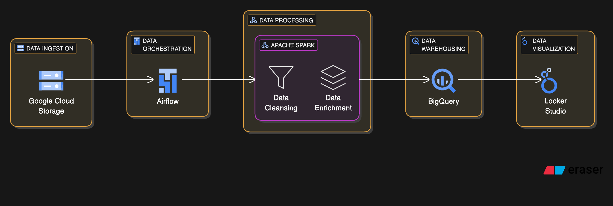

## Retail Intelligence Platform: Batch Analytics Pipeline for Sales & Customer Insights Project

### Problem statement

Retail businesses often struggle to turn raw transactional data into actionable insights due to data silos, inconsistent formats, and lack of scalable processing. The goal of this project is to design and implement a batch data processing pipeline that ingests, processes, and analyzes e-commerce retail transaction data to deliver product performance insights, sales trends, and customer behavior analytics using GCP-native tools.

The processed data will power a Looker Studio dashboard providing business users with:

* High-performing product identification

* Seasonal trends and demand forecasting

* Profitability insights by product and country

## Data Pipeline Architecture

